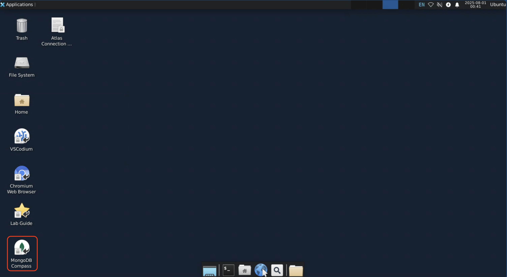
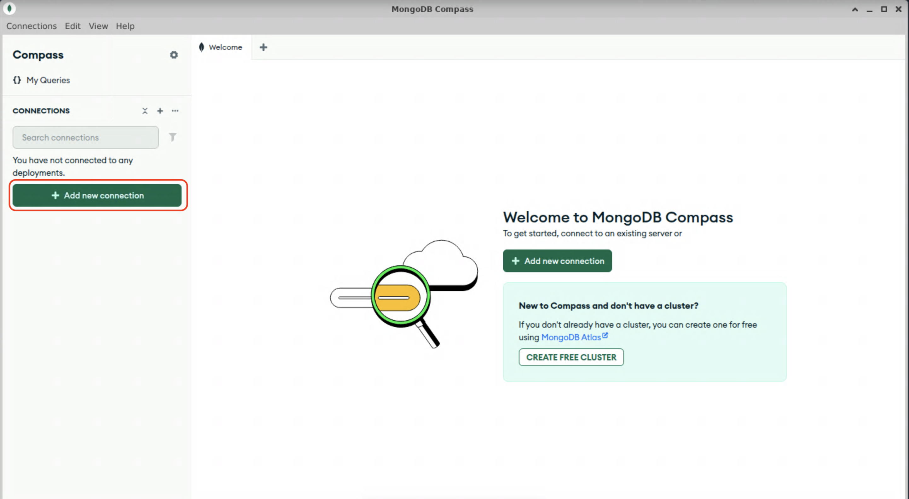
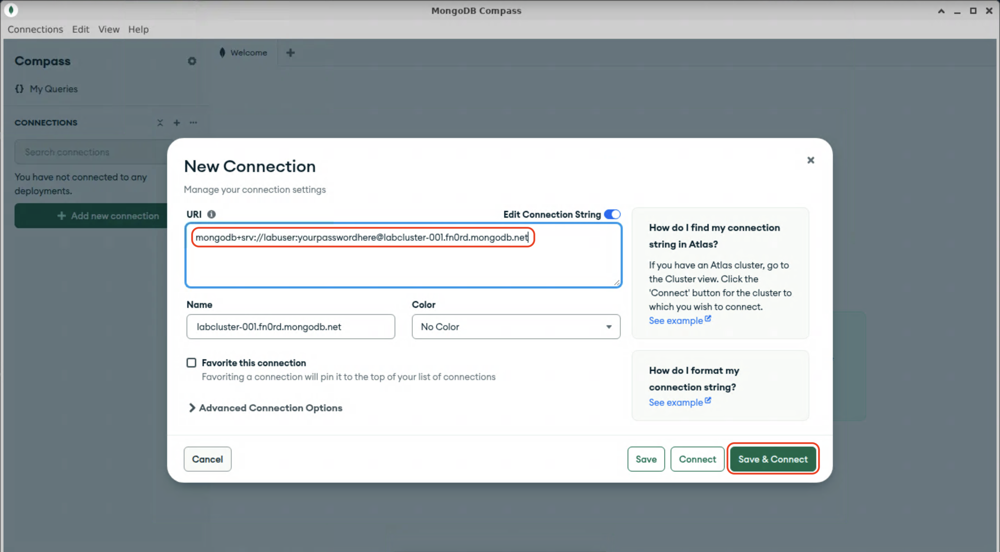
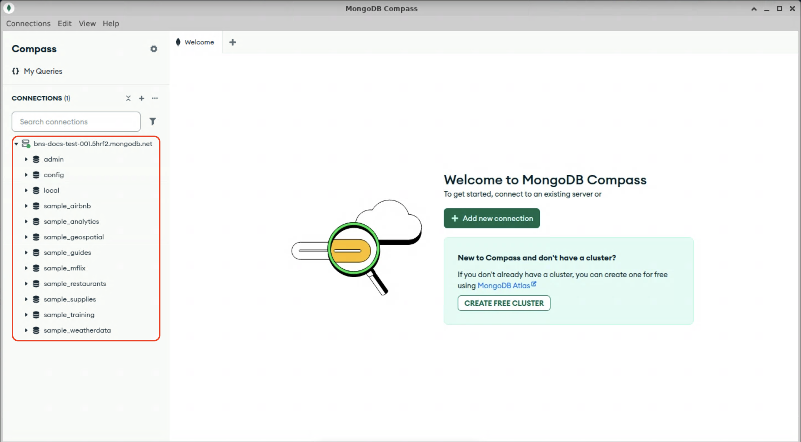

# Connecting to your Cluster with MongoDB Compass

## The Compass GUI
[MongoDB Compass](https://www.mongodb.com/try/download/compass) is a free
graphical tool for interacting with your MongoDB clusters. It is an easy way
to explore your database, run queries, build
[aggregation pipelines](https://www.mongodb.com/docs/manual/core/aggregation-pipeline/),
evaluate query performance, and more. Compass has been pre-installed on your
jumphost.

## LAB: Connect with MongoDB Compass
1. Double-click on the MongoDB Compass icon located on the jumphost desktop.

2. Dismiss the welcome screen and click the "+ Add New Connection" button.

3. Copy the connection string from [the last lab](/lab1/lab1-1?id=lab-finding-your-connection-string), 
and paste it into the `URI` field in the New Connection dialog box.
> 👆 **Note**: The jumphost is running Ubuntu Linux with the Xfce dekstop
> environment. If you are using a Mac, you'll need to use ^&nbsp;C and
> ^&nbsp;V instead of ⌘&nbsp;C and ⌘&nbsp;V to copy and paste, respectively.
4. Click "Save and Connect"

5. Compass should now connect to your MongoDB cluster. You should see several
default and sample database listed along the left hand side.

Feel free to explore the interface for a few minutes. When you are ready,
proceed to the next lab.