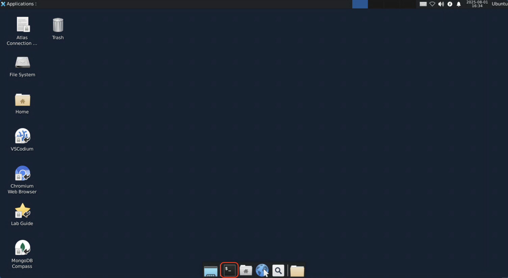
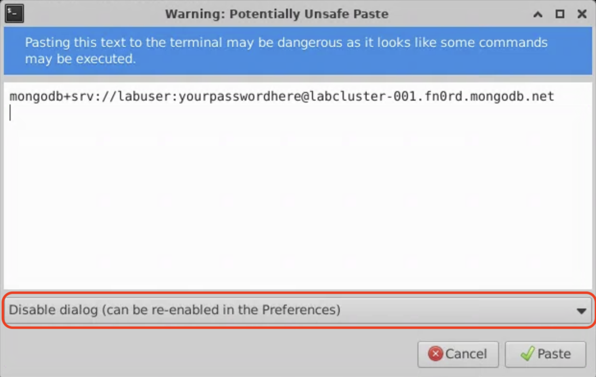
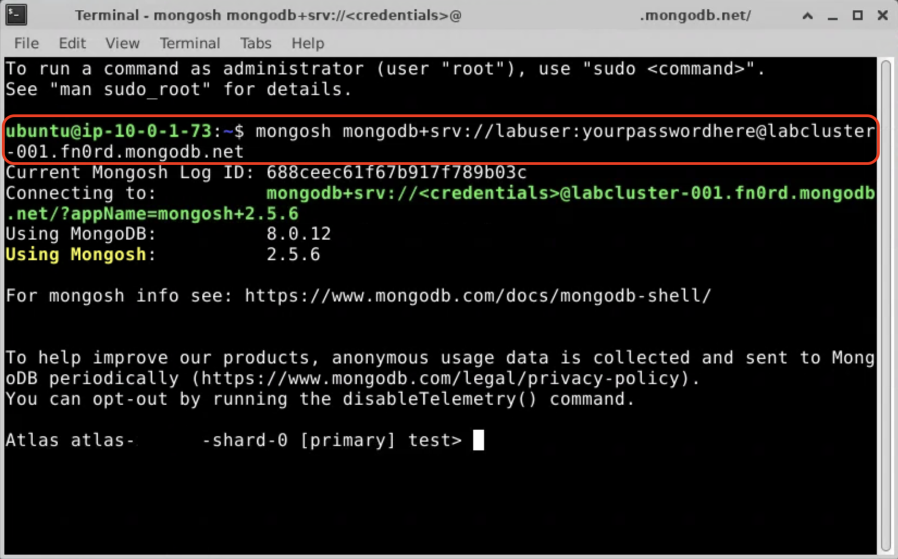
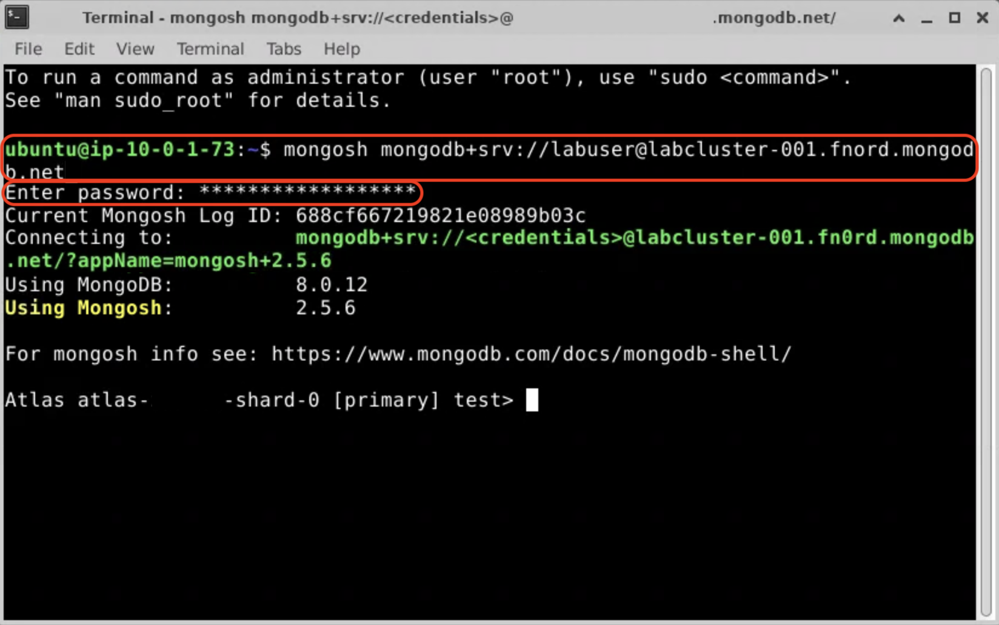
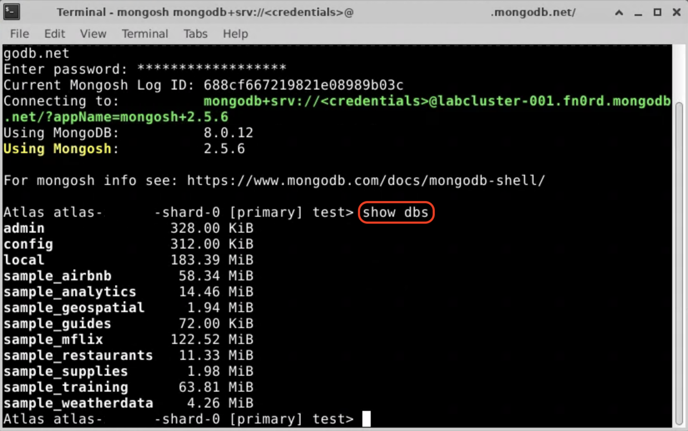

# Connecting to your cluster with mongosh

## mongosh
[mongosh](https://www.mongodb.com/docs/mongodb-shell/) is the MongoDB CLI.
It allows you to perform database operations on
your MongoDB clusters from a terminal. The objects and methods exposed in
mongosh are similar to those you would use in a language-specific driver.
It's a good way to test database operations interactively, similarly to
Compass, but in a command-line interface.

## LAB: Connect with mongosh

1. Open a terminal window on your jumphost



2. Run the following command, replacing `<connection string>` with your own
   connection string from lab 1-1.

  ```bash
  mongosh <connection string>
  ```

  > [!TIP]
  > In the terminal you need to use `Shift+Ctrl+C` and `Shift+Ctrl+V` to copy and paste, respectively.

  > [!NOTE] 
  > If you accidentally include the newline at the end of your
    connection string, the terminal will warn you that the text you are entering
    could potentially execute a command. To disable this warning, select "Disable
    dialog" from the drop-down menu in the warning pop-up.
    

  You should see a prompt similar to the screenshot below. If you don't,
  double-check your connection string and try again.

  

  > [!WARNING] 
  > For the purposes of this lab, we're simply pasting the
    connection string in its entirety, but this could result in the password
    being saved in your `.bash_history` file. See below for a safer way.

3. As noted, it's generally not good practice to include passwords in your
  command history. Let's try again, but this time we'll prompt for a password.

  Enter `Ctrl+D` to exit mongosh. Press the up arrow to bring up the last
  command entered, and go back and remove your password from the connection
  string on the command line.

  > [!NOTE] 
  > The credentials in your connection string are in the form
    of `username:password`, and are the next component after `mongodb+srv://`.
    Remove the first `:`, and everything up to but not including the `@` sign.

  Now when you run the command, you should be prompted to enter your password
  as shown below:

  

4. At the mongosh prompt, run the following command to list the available
  databases on this cluster:

  ```js
  show dbs;
  ```

  

When you are done, proceed to the next chapter.