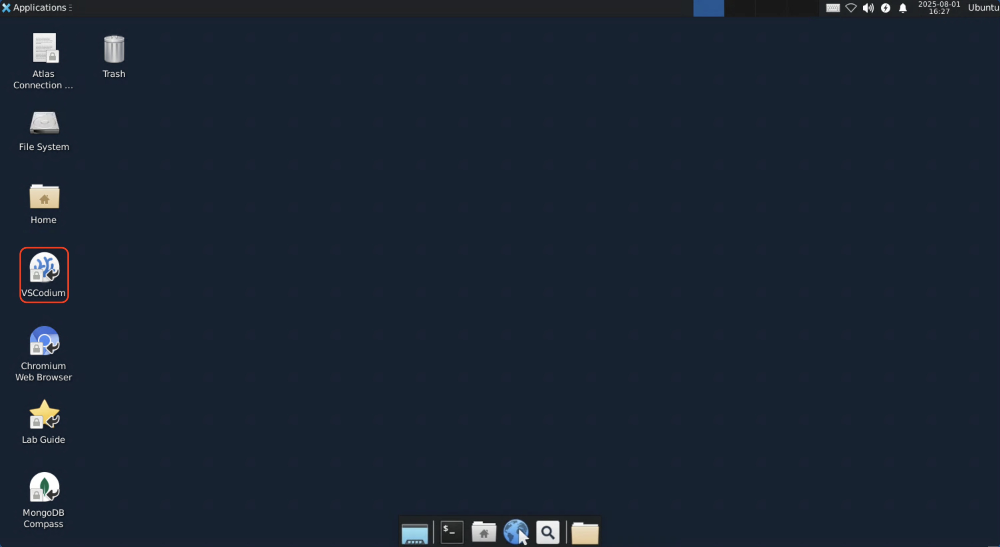
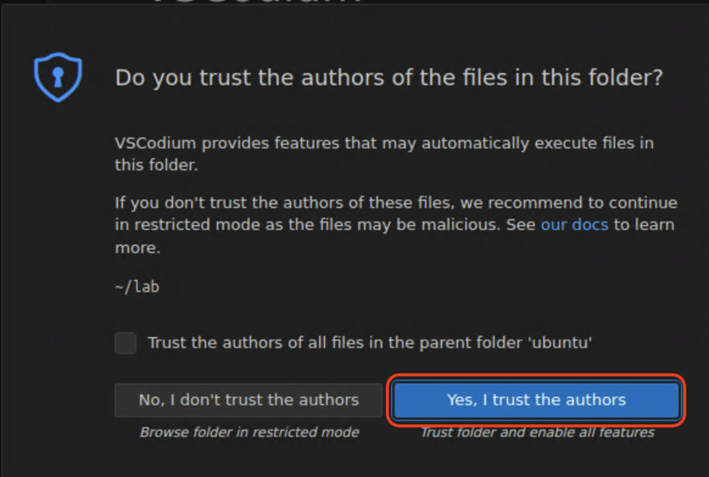
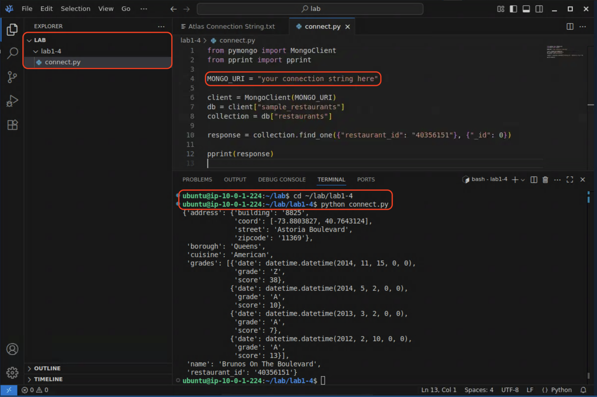

# Connecting with language-specifc drivers (Python)

## Language-specific drivers
MongoDB provides [native drivers](https://www.mongodb.com/docs/drivers/) 
for all modern programming languages, and some less-modern ones too. These 
drivers are idiomatic to their languages, i.e.: they implement the classes,
methods, and helpers needed to interact with MongoDB in a way that matches the
style and conventions of the particular programming language for which they
are written. This is in contrast to most relational databases, which require a
different language (i.e.: SQL) to describe database operations.

## The Python driver
The official MongoDB Python driver is called 
[PyMongo](https://www.mongodb.com/docs/languages/python/). You may have heard
of another driver, motor, used for async Python. Motor is now deprecated in
favour of the PyMongo Async API now included in PyMongo. Some classes you will
interact with include:

- `pymongo.MongoClient`/`pymongo.AsyncMongoClient`: The client instance that 
  connects to a MongoDB cluster
- `pymongo.database.Database`: An instance of a database
- `pymongo.collection.Collection`: A colletion in a database
- `pymongo.cursor.Cursor`: An iterable cursor returned by database operations

## LAB: Connect with PyMongo

1. On your jumphost, double-click the "VSCodium" icon on your desktop.
  

  > [!NOTE]
  > [VSCodium](https://vscodium.com/) is an open-source binary build of [vscode](https://github.com/Microsoft/vscode).

  > [!NOTE] 
  > VSCodium should automatically open to the lab folder. If it 
    doesn't, click "File -> Open Folder", browse to the `/home/ubuntu/lab`
    folder, and open it.

  > [!NOTE] 
  > The first time you launch VSCodium, you will be asked if you
    trust the authors of the `lab` directory. Click "Yes, I trust the authors"
    to continue.
    

2. In the lab folder structre, open the file lab1-4/connect.py and examin the code.
  There are a few sections to the file:

  First we load the require modules, including the core MongoDB client class:
  ```python
  from pymongo import MongoClient
  from pprint import pprint
  ```

  Next we define a variable for our connection string. Replace 
  `your connection string here` with your Atlas connection string from lab 1-1:
  ```python
  MONGO_URI = "your connection string here"
  ```

  The next three lines create a MongoDB client, and create objects for one of
  the example databases, and a collection within that database:
  ```python
  client = MongoClient(MONGO_URI)
  db = client["sample_restaurants"]
  collection = db["restaurants"]
  ```

  The next line is where the actual database query is executed. We call the
  `.find_one()` method on the collection object. This method returns a single
  document that matches the query predicate:
  ```python
  response = collection.find_one({"restaurant_id": "40356151"}, {"_id": 0})
  ```

  Finally, we format and print the response to the console:
  ```python
  pprint(response)
  ```

3. After you have replaced the placeholder text with your Atlas connection
  string, save the file (Ctrl+S or File -> Save)

4. Open a terminal (`Ctrl+Shift+~` or View -> Terminal), change to the lab1-4
  directory, and run the `connect.py` program.
  ```bash
  cd ~/lab/lab1-4
  python connect.py
  ```

  You should see the record for the restaurant "Brunos on the Boulevard" output
  on the console.
  

> [!NOTE]
> You won't need to copy your connection string for every lab. In the lab environment, it has been pre-populated for you as the `$MDB_URI` environment variable. Future labs will use this variable instead of requiring you to input it every time.

When you are done, proceed to the end of this lab.