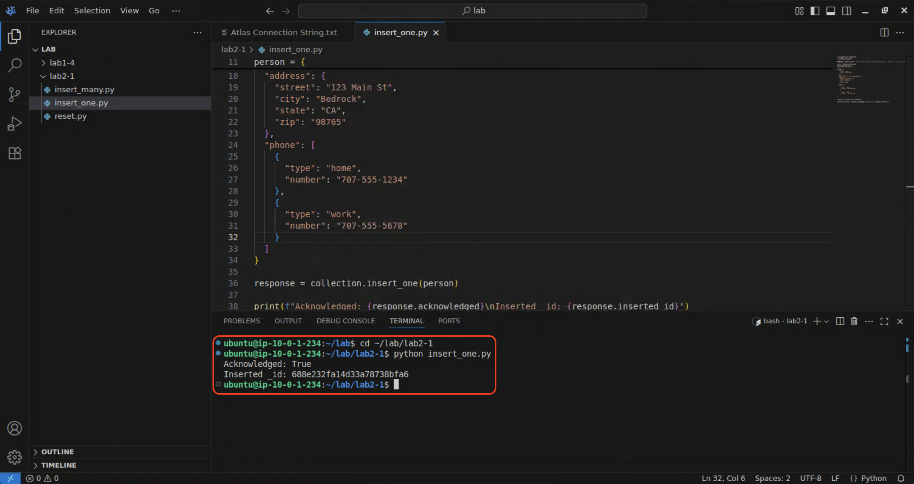
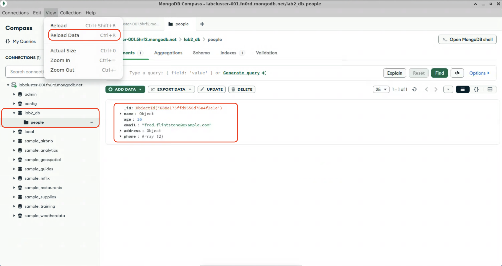
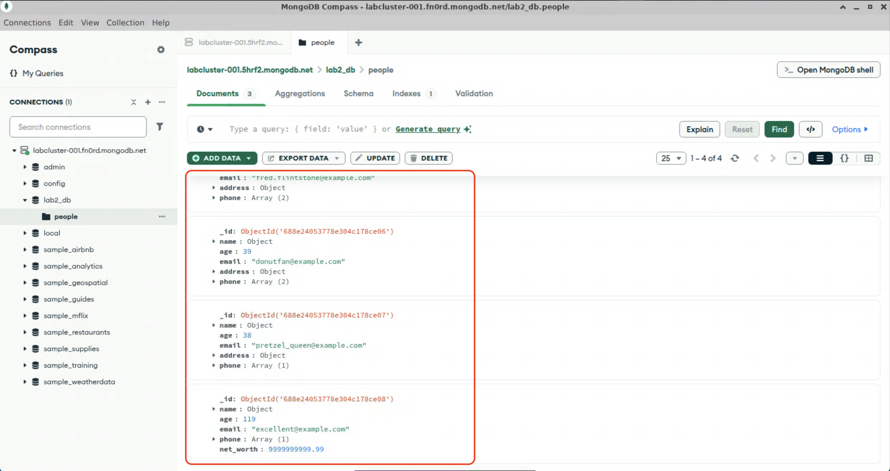

# Creating documents

The flexibility of the document model makes inserting data into MongoDB extremely simple. While data modelling and schema validation are important, creating a record is often as simple as calling `.insertOne()` (or your language's equivalent) with the object as an argument.

> [!NOTE]
> If you want to reset the lab and remove the database that has been created, run `python3 reset.py` in the lab2-1 folder. Or, for 🎓&nbsp;extra credit, see if you can do it yourself through Compass or mongosh!

## Inserting one document

1. In your jumphost, open Compass and VSCodium, if they aren't already open.
  > [!NOTE]
  > Refer to labs [1-2](lab1/lab1-2.md) and [1-4](lab1/lab1-4.md) for help getting started with Compass and VSCodium, if you haven't already.

2. In VSCodium, open the file lab2-1/insert_one.py and examine the code. Note the `person` dict: there is no predefined schema that this object is adhering to.

  <details>
  <summary>See code</summary>

  ```python
  fred = {
    "name": {
      "first": "Fred",
      "last": "Flintstone"
    },
    "age": 36,
    "email": "fred.flintstone@example.com",
    "address": {
      "street": "123 Main St",
      "city": "Bedrock",
      "state": "CA",
      "zip": "98765"
    },
    "phone": [
      {
        "type": "home",
        "number": "707-555-1234"
      },
      {
        "type": "work",
        "number": "707-555-5678"
      }
    ]
  }
  ```
  </details>

  Note the names of the database (`lab2_db`) and collection (`people`). Check in Compass to verify that neither the database nor collection exist yet.

  > [!TIP]
  > Databases and collections don't need to be pre-created; the first time you insert a document, the collection (and database, if necessary) will be automatically created.

4. Back in VSCodium, look at the `collection.insert_one()` instruction. This is a collection method, and it takes the object to insert as its first argument. Note that there is no mapping of the object's properties to fixed columns; the document will be the whole object.

  > [!NOTE]
  > These labs are primarily written in Python, due to its popularity and readability. The methods we will be using are not unique to the Python driver, but they may be named differently in different languages to match the naming conventions of those languages. For example, the `.insert_one()` method in PyMongo is analagous to the `.insertOne()` method in mongosh/JavasScript, or the `.InsertOne()` method in .NET/C#.

5. In the terminal window, change to the lab2-1 directory, and run the `insert_one.py` program.
  ```bash
  cd ~/lab/lab2-1
  python insert_one.py
  ```
  > [!TIP]
  > If you closed the terminal, press `Ctrl+Shift+~` to re-launch it.

6. The `insert_one()` method returs a result object with an `acknowledged` and an `inserted_id` attribute. You should see confirmation in the terminal that the document was created. 
  

  Switch back to Compass and see that the database and collection have been created.

7. Expand the `lab2_db` database and select the `people` collection. Observe that your document has been committed to the database.
  > [!TIP]
  > You might need to refresh the Compass window to see the new database, collection, and document; use `Ctrl+R` or View -> Reload.

  

8. 🎓*Extra Credit*: Modify the `person` object with a different name, e-mail address, other details as you see fit, and then re-run the `insert_one.py` program. Check back in Compass to confirm that the new document has been created.

## Inserting many documents

While the `.insert_one()` method takes a single object, the `.insert_many()` method, as the name implies, takes a list (array) of documents and inserts each of them into the target collection. 

1. In VSCodium, open the file lab2-1/insert_many.py and examine the code.

2. Inspect the `many_people` list. Notice that there are multiple objects in the list, but they don't all share the same structure. MongoDB collections can be polymorphic; that is, they can store documents with different shapes alongside each other.

3. 🎓*Extra Credit*: Add another object to the list for another member of the household.

4. In the terminal, run the `insert_many.py` program. Note the output of the program; whereas `insert_one()` returns a result with an `inserted_id` attribute containing a single ObjectID, `insert_many()`'s return object contains an `inserted_ids()` attribute, which is a list of ObjectIDs for each inserted document.

5. Check in Compass to see that the new documents have been created. Notice that even in the database, the schema is flexible; some documents contain arrays with more or fewer items, and some documents have different poperties.
  

When you are done, proceed to the next lab.