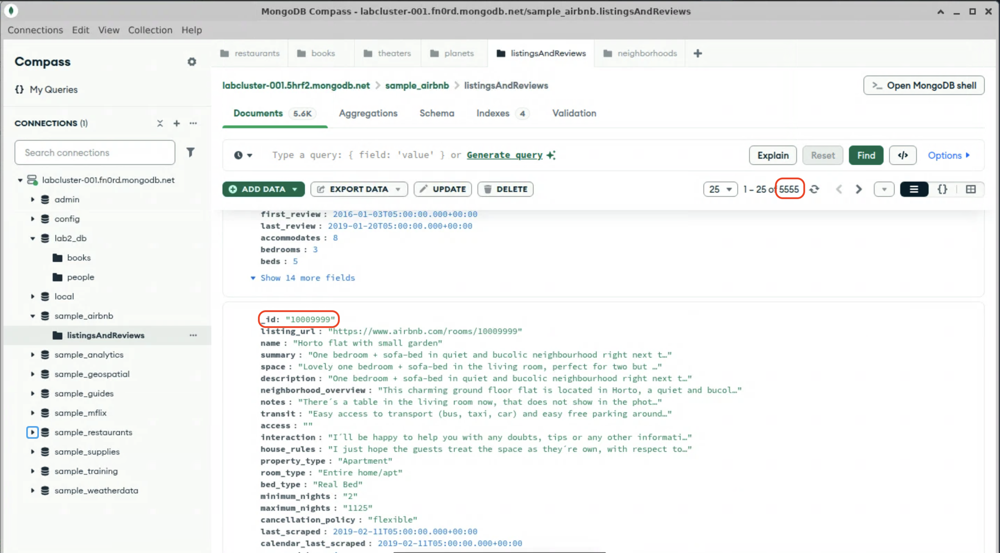

# Deleting Documents

If you are comfortable with finding and updating documents, the methods for deleting documents, `delete_one()` and `delete_many()` should feel familiar. For this module, we will use the `sample_airbnb` database that has been pre-loaded onto your cluster. Feel free to take a look at the structure of the documents in this database in Compass.

> [!NOTE]
> The mongosh/JavaScript methods equivalent to `delete_one()` and `delete_many()` are `deleteOne()` and `deleteMany()`, respectively.

## Deleting one document

The `delete_one()` method deletes the first document that matches the filter criteria, if one exists in the database.

1. In VSCodium, open the file lab2-4/delete_one.py and examine the code. The syntax of the `delete_one()` method should look very similar to the `find()` and `find_one()` methods from lab 2-2.

2. In Compass, browse the `listingsAndReviews` collection in the `sample_airbnb` database. Note the total number of documents in the collection, and pick a record to delete. Copy the `_id` field to use as the query filter.

  

  > [!NOTE]
  > You might notice something different about the `_id` field in this database. Every document must have a unique `_id` field, and if a value for `_id` isn't supplied when a document is inserted, either the MongoDB driver or the server itself will generate one with the data type `ObjectId`. All of the documents we've worked with so far have used this default auto-generated `_id`, but any unique, immutable value can be supplied for the `_id` field when a document is inserted. In this database, the `_id` field is a unique string representation of the application's own listing ID.

3. Edit the `delete_one()` instruction in `delete_one.py` to delete the listing you chose in step 2.

  > [!TIP]
  > Remember that the `_id` fields in this database contain strings, not numbers, even though the strings only contain numeric characters.

  <details>
  <summary>Modified code</summary>

  ```python
  response = collection.delete_one({"_id": "1000999"})
  ```
  </details>

4. In the terminal window, change to the lab2-4 directory, and run the `delete.py` program.
  ```bash
  cd ~/lab/lab2-4
  python delete_one.py 
  ```

  RESULTS

5. Refresh Compass (<kbd>Ctrl</kbd>+<kbd>R</kbd>), and see the change to the document count.

## Deleting many documents

Much like `delete_one()`, `delete_many()` also takes a query filter to select documents for deletion; however, rather than only deleting the first document, it deletes all that match the query. You can use [query operators](https://www.mongodb.com/docs/manual/reference/operator/query/) to select a range of documents, beyond a simple exact match. In this example we will delete all listings with a `last_review` before January 1st, 2018.

1. In VSCodium, open the file lab2-4/delete_many.py and examine the code. The `last_review` field is of the `Date` BSON type. PyMongo maps BSON `Date` objects to Python `datetime.datetime` objects.

2. Modify the `delete_many()` instruction to include a query filter that will match documents where the `last_review` field is less than (before) January 1st, 2018.

  <details>
  <summary>Modified code</summary>

  ```python
  response = collection.delete_many({"last_review": {"$lt": last_review_date}})
  ```
  </details>

3. Run the `delete_many.py` program, and observe the results.

4. Refresh Compass and see the change to the document count.

When you are done, proceed to the end of this lab.
