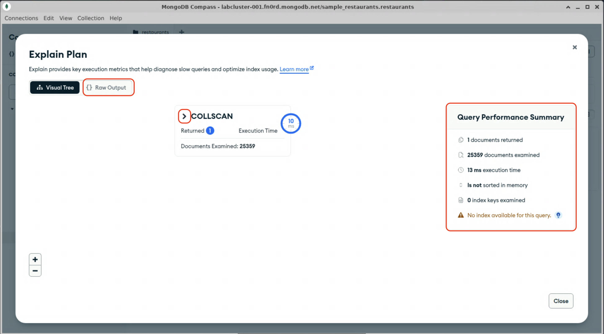

# The `explain()` command

MongoDB provides a database command, [`explain()`](https://www.mongodb.com/docs/manual/reference/command/explain/), to provide insight on how a query is planned and executed, what index(es) are used, and statistics on the query's execution. This is useful for analyzing slow-running queries and validating your indexing strategy.

## `explain()` in mongosh

1. Open a command terminal (or use the integrated one in VSCodium), and launch mongosh:
  > [!TIP]
  > Since your connection string has been set in an environment variable, you don't need to copy and paste it every time.

  ```bash
  mongosh $MDB_URI
  ```

2. Select the `sample_restaurants` database:
  ```js
  use sample_restaurants;
  ```

3. Run the following command to query the `restaurants` collection for the resaurant named "Lucia Pizza":
```js
db.restaurants.find({name: "Lucia Pizza"});
```

4. That probably seemed pretty fast to human eyes, but how fast was it? `explain()` is a [database command](https://www.mongodb.com/docs/manual/reference/command/), but mongosh also provides a `.explain()` helper for collection operations that return a cursor. Re-run the above command, but also call the `.explain()` method, with the parameter `"executionStats"`, to tell `explain()` to provide details on the actual execution of this query,
  ```js
  db.restaurants.find({name: "Lucia Pizza"}).explain("executionStats");
  ```

  <details>
  <summary>Expected results:</summary>

  ```js
  Atlas atlas-fn0rd-shard-0 [primary] sample_restaurants> db.restaurants.find({naname: "Lucia Pizza"}).explain("executionStats");
  {
    explainVersion: '1',
    queryPlanner: {
      namespace: 'sample_restaurants.restaurants',
      parsedQuery: { name: { '$eq': 'Lucia Pizza' } },
      indexFilterSet: false,
      queryHash: '544F3E5C',
      planCacheShapeHash: '544F3E5C',
      planCacheKey: 'B9363AF4',
      optimizationTimeMillis: 0,
      maxIndexedOrSolutionsReached: false,
      maxIndexedAndSolutionsReached: false,
      maxScansToExplodeReached: false,
      prunedSimilarIndexes: false,
      winningPlan: {
        isCached: false,
        stage: 'COLLSCAN',
        filter: { name: { '$eq': 'Lucia Pizza' } },
        direction: 'forward'
      },
      rejectedPlans: []
    },
    executionStats: {
      executionSuccess: true,
      nReturned: 1,
      executionTimeMillis: 13,
      totalKeysExamined: 0,
      totalDocsExamined: 25359,
      executionStages: {
        isCached: false,
        stage: 'COLLSCAN',
        filter: { name: { '$eq': 'Lucia Pizza' } },
        nReturned: 1,
        executionTimeMillisEstimate: 10,
        works: 25360,
        advanced: 1,
        needTime: 25358,
        needYield: 0,
        saveState: 0,
        restoreState: 0,
        isEOF: 1,
        direction: 'forward',
        docsExamined: 25359
      }
    },
    queryShapeHash: '546DBA367F7D60006AA530BE004856A435E30F9D8D6EE6B3C42B3B89D9D9A0BB',
    command: {
      find: 'restaurants',
      filter: { name: 'Lucia Pizza' },
      '$db': 'sample_restaurants'
    },
    serverInfo: {
      host: 'atlas-106ftn-shard-00-01.5hrf2.mongodb.net',
      port: 27017,
      version: '8.0.12',
      gitVersion: 'b60fc6875b5fb4b63cc0dbbd8dda0d6d6277921a'
    },
    serverParameters: {
      internalQueryFacetBufferSizeBytes: 104857600,
      internalQueryFacetMaxOutputDocSizeBytes: 104857600,
      internalLookupStageIntermediateDocumentMaxSizeBytes: 104857600,
      internalDocumentSourceGroupMaxMemoryBytes: 104857600,
      internalQueryMaxBlockingSortMemoryUsageBytes: 104857600,
      internalQueryProhibitBlockingMergeOnMongoS: 0,
      internalQueryMaxAddToSetBytes: 104857600,
      internalDocumentSourceSetWindowFieldsMaxMemoryBytes: 104857600,
      internalQueryFrameworkControl: 'trySbeRestricted',
      internalQueryPlannerIgnoreIndexWithCollationForRegex: 1
    },
    ok: 1,
    '$clusterTime': {
      clusterTime: Timestamp({ t: 1754236067, i: 17 }),
      signature: {
        hash: Binary.createFromBase64('+NilmWXRCp/4qsmGIafNiW882QU=', 0),
        keyId: Long('7534340224596312070')
      }
    },
    operationTime: Timestamp({ t: 1754236067, i: 17 })
  }
  Atlas atlas-fn0rd-shard-0 [primary] sample_restaurants> 
  ```
  </details>

  Look at the results returned by `explain()`. In particular, look at the `executionStats` nested object:
  ```js
  executionStats: {
    executionSuccess: true,
    nReturned: 1,
    executionTimeMillis: 13,
    totalKeysExamined: 0,
    totalDocsExamined: 25359,
    executionStages: {
      isCached: false,
      stage: 'COLLSCAN',
      filter: { name: { '$eq': 'Lucia Pizza' } },
      nReturned: 1,
      executionTimeMillisEstimate: 10,
      works: 25360,
      advanced: 1,
      needTime: 25358,
      needYield: 0,
      saveState: 0,
      restoreState: 0,
      isEOF: 1,
      direction: 'forward',
      docsExamined: 25359
    }
  }
  ```
  The `executionTimeMillis` property tells us how long the query took to execute (13ms in this case), and we can see from the `nReturned` and `totalDocsExamined` properties that the database had to look through all 25359 records to find the one where `name` is equal to "Lucia Pizza". Looking down to the `executionStages` section, we can see that it used the `COLLSCAN` stage, which&mdash;as the name implies&mdash;scans the entire collection for matching documents. We'll address this in the next module.

## Explaining a query in Compass

MongoDB Compass provides a more graphical way of visualizing the output of `explain()`. Combined with the ability to run and modify queries visually and in real-time, it is a very useful tool for designing queries and evaluating their performance.

1. Open Compass and navigate to the `restaurants` collection in the `sample_restaurants` database.

2. In the query field, enter a query to find the resaurant named "Lucia Pizza", and click "Find".

  <details>
  <summary>Expected result</summary>

  
  </details>

3. With the query still in the query field, click "Explain".

  You should see a graphical representation of the same data you saw in mongosh:
  

  In the main area of the screen, you can see that the query used a collection scan as its only stage. You can click the <kbd>></kbd> icon to see the stage details in JSON format.

  To the right there is a summary of the overall performance for this query. Like in mongosh, you can see that it need to scan all 25359 records to return just one matching document, that the overall query took 13ms to execute, and that there was no index available for this query.

  In the top left, you can switch between the graphical view and the raw JSON ouput, as you saw in mongosh.

In the next module, we will create some indexes to improve the performance of these queries.

When you are done, proceed to the next lab.