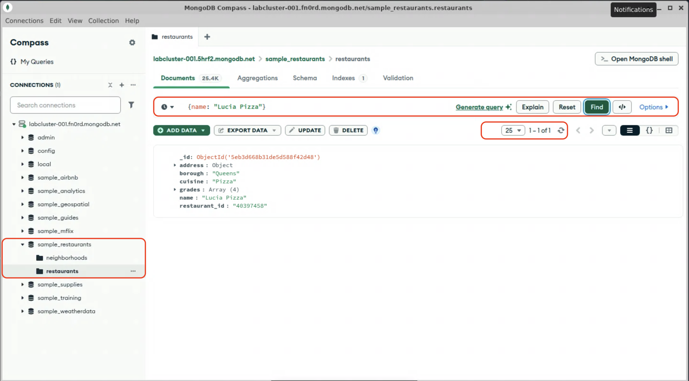
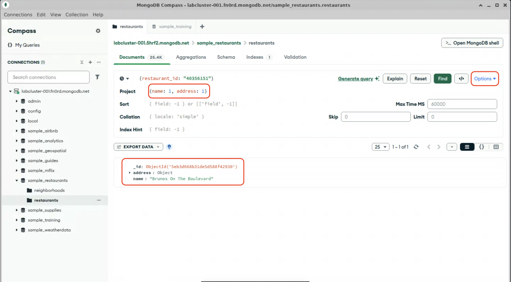
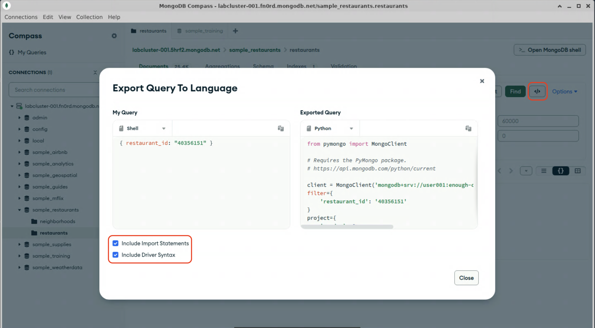

# Projections

[Projection](https://www.mongodb.com/docs/manual/tutorial/project-fields-from-query-results/) restrict the fields returned in a query to only include relevant information. The projection argument is a document (e.g.: dict), where the keys correspond to fields to either include or exclude from the results. 

## Inclusion
You can return only specific fields by giving the fields you want to include a value of "1" in the projection document. For example, in the `restaurants` collection in the `sample_restaurants` database, to include only the object ID, name and address in a response, your projection document would be:
```python
{"name": 1, "address": 1}
```

1. Open Compass and navigate to the `restaurants` collection in the `sample_restaurants` database, if you haven't already done so.

2. Enter the query filter from lab 2-2 into the query field and click "Find"
  ```js
  {restaurant_id: "40356151"}
  ```

  <details>
  <summary>Expected results</summary>

  
  </details>

3. Add an inclusive projection to the query. Click "Options ▼", enter the following projection in the "Project" field, and click "Find":
  ```js
  {name: 1, address: 1}
  ```

  <details>
  <summary>Expected results</summary>

  
  </details>

  > [!NOTE]
  > Notice that the `_id` field was included in your results, even though you didn't specify it in the projection document. The `_id` field is always included, unless explicitly excluded.

## Exclusion
You can return all fields except for specific ones by giving the fields you want to exclude a value of "0" in the projection response. For example, to return all fields except for inspection grades, your projection document would be:
```python
{grades: 0}
```

> [!NOTE]
> With the exception of excluding the `_id` field, you cannot combine inclusion and exclusion statements in projection documents.

1. In compass, modify the projection document to exclude only the `grades` field, and re-run the query:

  <details>
  <summary>Hint</summary>

  ```js
  {grades: 0}
  ```
  </details>

  <details>
  <summary>Expected results</summary>

```js
  {
    "_id": {
      "$oid": "5eb3d668b31de5d588f42930"
    },
    "address": {
      "building": "8825",
      "coord": [
        -73.8803827,
        40.7643124
      ],
      "street": "Astoria Boulevard",
      "zipcode": "11369"
    },
    "borough": "Queens",
    "cuisine": "American",
    "name": "Brunos On The Boulevard",
    "restaurant_id": "40356151"
  }
  ```
  </details>

2. Modify the projection docuent to also exclude the `_id` and `restaurant_id` fields. Re-run `exclude_fields.py` and check your results.
  <details>
  <summary>Expected results</summary>

  ```js
  {
    "address": {
      "building": "8825",
      "coord": [
        -73.8803827,
        40.7643124
      ],
      "street": "Astoria Boulevard",
      "zipcode": "11369"
    },
    "borough": "Queens",
    "cuisine": "American",
    "name": "Brunos On The Boulevard"
  }
  ```
  </details>

3. 🎓 *Extra Credit*: Write a projection to only include the name, address, and cuisine fields, and *not* the `_id` field. Run the query and check your work.


## Language-specific syntax

You may have noticed that we didn't enclose the keys in our query and projection documents in quotes, like we did in the Python programs in the last lab. Compass uses mongosh syntax for specifying filter documents, which is based on JavaScript, where you don't need to enclose object keys in quotes unless they are using dot notation (more on that later). 

Since each driver is idiomatic to its language, the syntax for replicating a particular query from Compass into another language may be different. Fortunately, Compass can handle that translation for you.

1. Click the "Export Query to Language" button <kbd>&lt;/&gt;</kbd> to generate code in the correct syntax for your language of choice. 

2. In the "Exported Query" section, ensure "Python" is selected as the destination language. You should see your query formatted as a Python dict, complete with quoted key names.

3. Select the "Include Import Statements" and "Include Driver Syntax" options (you may need to scroll down to see these options.) This will generate additional code that, in most cases, can be copied directly into your application. For example, in Python, the projection document is supplied as the `project` argument to `find()` or `find_one()`, or as the 2nd positional argument.
  

4. 🎓 *Extra Credit*: Try making a new Python program from your exported code.


When you are done, proceed to the next lab.