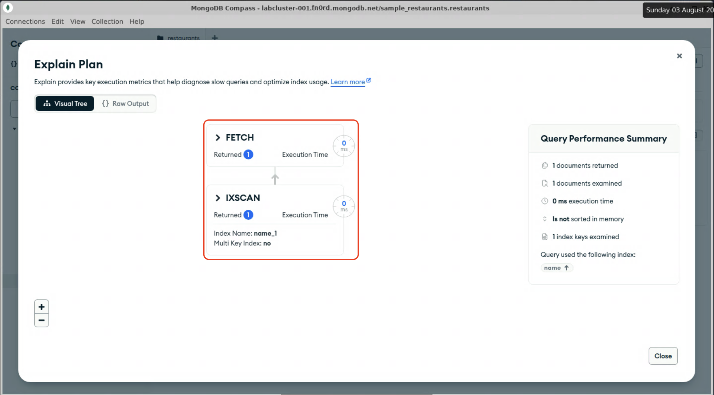

# Single-key indexes

In the previous module, we ran a query that was not supported by an index, and that the database needed to inspect every document in the collection to return a result. For small datasets this may be acceptable, but the execution time will increase linearly with the size of the dataset (O(N) complexity). An index is a sorted data structure optimized for quick retrieval of arbitrary elements; the execution time against an index grows logarithmically as the size of the dataset increases (O(log N) complexity), i.e.: the search time increases very slowly as the data volume increases.

## Creating a single-field index in mongosh

1. Open mongosh in a terminal window

2. Change to the "sample_restaurants" database.
  <details>
  <summary>Hint</summary>

  ```js
  use sample_restaurants;
  ```

  The `createIndex()` mongosh method creates an index on a collection, and takes a document where the keys are one or more database fields to index, and the values are the sort order for that field (1 for ascending, -1 for descendng). In our case, we want to efficiently find restaurants by name, so we want an index that contains the `name` field. Sort order isn't important for this use case, but if we are going to sort our results it will likely be alphabetically, so we'll choose `1` for an ascending order sort. The index document then would look like this:
  ```js
  {name: 1}
  ```

3. Run the following mongosh command to create an index in the `restaurants` collection, containing the `name` field sorted in ascending order:
  ```js
  db.restaurants.createIndex({name: 1});
  ```

  <details>
  <summary>Expected output</summary>

  ```js
  Atlas atlas-106ftn-shard-0 [primary] sample_restaurants> db.restaurants.createIndex({name: 1});
  name_1
  Atlas atlas-106ftn-shard-0 [primary] sample_restaurants> 
  ```
  </details>

  Note that the command returned the name of the created index, `name_1`. You can specify a name for the index, but by default MongoDB concatenates the field names and sort orders to name indexes.

4. In Compass, run the query from the previous lab again to find the restaurant named "Lucia Pizza" (refer the lab 3-1 if needed), and click "Explain" to see how the query plan has changed.

  <details>
  <summary>Expected result</summary>

  
  </details>

  You can see that the query executed much more quickly, in under a millisecond. Because MongoDB was able to efficiently find the matching record in the index, it only needed a single fetch operation to retrieve the document and return it to the client. 12ms might not make a perceptible difference to a user making one query, but across millions of queries, it can add up to significant performance gains.

When you are done, proceed to the next lab.
