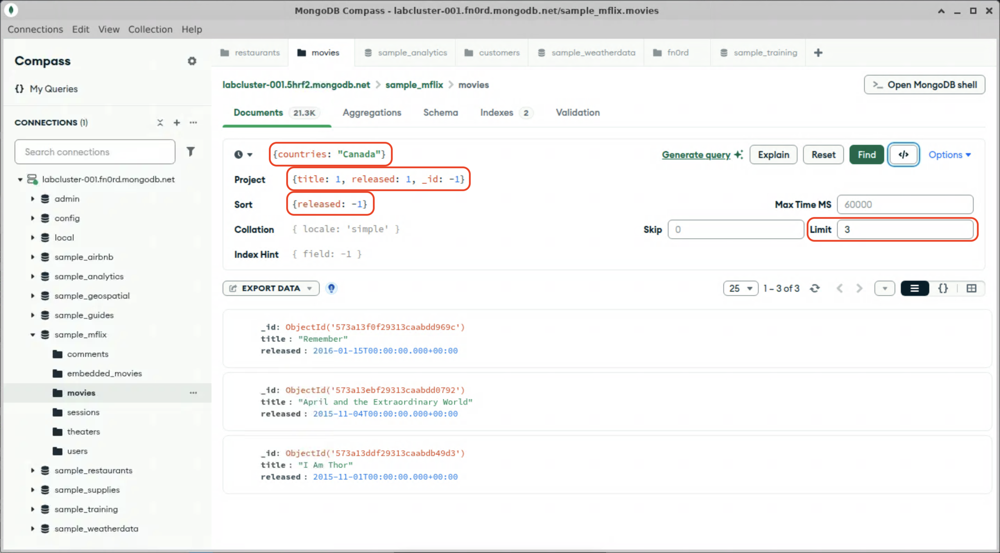

# Sorting, limiting, and counting

MongoDB generally returns documents in the order that they are found. This is usually the order in which they are indexed. You may want to receive your results in a different order, or you might want to only fetch the *n* first or last documents in a given range. Or, you might not actually care about the content, and you just need to know how many documents match a particular criteria. 

MongoDB queries can specify a sort order and document limit. Language-specific drivers also provide methods to count the number of documents that match a query filter, without actually returning those documents.

## Specifying a sort order and limit

Sort order is specified by a document, where the keys are the fields to sort by, and the values are the sort order: 1 for ascending, -1 for descending. For example, to sort the `restaurants` collection in the `sample_restaurants` database first by borough, then by cuisine type, you would specify:
```js
{borough: 1, cuisine: 1}
```

Or to sort the `movies` collection in the `sample_mflix` database by release date, with the most recent movies first, your sort document would be:
```js
{released: -1}
```

### mongosh

In `mongosh`, the 3rd positional argument to the `db.collection.find()` method is an [options document](https://www.mongodb.com/docs/manual/reference/method/db.collection.find/#options), which specifies additional options related to the query, including `sort` and `limit`. 

<h5>db.collection.find( <span style="color:#1c00ff">{ field: "value" }</span>, <span style="color:#ff0000">{ name: 1, _id: 0 }</span>,<span style="color:#04a200"> {sort: { date: -1 }, limit: 5 }</span> );</h5>

- <span style="color:#1c00ff">{ field: "value" }</span>: The query filter
- <span style="color:#ff0000">{ name: 1, _id: 0 }</span>: The projection
- <span style="color:#04a200">{sort: { date: -1 }, limit: 5 }</span>: The options document: this document specifies two options; the results should be sorted by date in descending order, and only the 5 most recent results should be returned.

1. Open a command terminal (or use the integrated one in VSCodium), and launch mongosh:
  > [!TIP]
  > Since your connection string has been set in an environment variable, you don't need to copy and paste it every time.

  ```bash
  mongosh $MDB_URI
  ```

2. Switch to the `sample_mflix` database:
  ```js
  use sample_mflix;
  ```

3. Create a `mongosh` command to return only the title and release date of the 3 most recently released movies in Canada. Run it and check your results.

  <details>
  <summary>Hint</summary>

  These are all things we've learaned so far, but now we're putting them together. First, we need the `find()` command:
  ```js
  db.movies.find();
  ```

  We're only looking for movies released in Canada, so we want the `countries` array to contain the string `"Canada"`:
  ```js
  db.movies.find({countries: "Canada"});
  ```

  We remember how to project our results, we'll include the `title` and `released` fields, and explicitly exclude the `_id` field:
  ```js
  db.movies.find({countries: "Canada"},{title: 1, released: 1, _id: 0});
  ```

  Finally, we'll add our options document, to sort by `released` in descending order, and to limit the result to only the first 3, resulting in our complete `mongosh` command:
  ```js
  db.movies.find({countries: "Canada"},{title: 1, released: 1, _id: 0}, {sort: {released: -1}, limit: 3});
  ```
  </details>

  <details>
  <summary>Expected results</summary>

  ```js
  Atlas atlas-fn0rd-shard-0 [primary] sample_mflix> db.movies.find({countries: "Canada"},{title: 1, released: 1, _id: 0}, {sort: {released: -1}, limit: 3});
  [
    { title: 'Remember', released: ISODate('2016-01-15T00:00:00.000Z') },
    {
      title: 'April and the Extraordinary World', released: ISODate('2015-11-04T00:00:00.000Z')
    },
    { title: 'I Am Thor', released: ISODate('2015-11-01T00:00:00.000Z') }
  ]
  Atlas atlas-fn0rd-shard-0 [primary] sample_mflix> 
  ```

### Compass

Compass also allows you to provide additional options to sort and limit your queries.

1. In Compass, navigate to the `movies` collection in the `sample_mflix` database.

2. Populate the query field with the query from the mongosh exercise.

3. Click "Options ▼", and populate the projection, sort, and limit fields with the values from the mongosh exercise.
  

4. Run the query and check your results.

### PyMongo

PyMongo takes the same options as `mongosh`, but because Python supports named arguments, it doesn't use the options document. 

1. In VSCodium, change to the lab3-6 folder and open `find_movies.py`. Examine the code, run it, and check your results.

  > [!NOTE]
  > This code does the same thing as the `mongosh` command above, but notice that instead of a options document, we're supplying the sort and limit options as keyword parameters to the `.find()` method. Also note that filters, projections, and other options are just regular Python variables. You can programmatically compose a query without additional string manipulation to convert it into a SQL statement.

  <details>
  <summary>Expected results</summary>

  ```python
  {'_id': ObjectId('573a13f0f29313caabdd969c'),
  'released': datetime.datetime(2016, 1, 15, 0, 0),
  'title': 'Remember'}
  {'_id': ObjectId('573a13ebf29313caabdd0792'),
  'released': datetime.datetime(2015, 11, 4, 0, 0),
  'title': 'April and the Extraordinary World'}
  {'_id': ObjectId('573a13ddf29313caabdb49d3'),
  'released': datetime.datetime(2015, 11, 1, 0, 0),
  'title': 'I Am Thor'}
  ```

## Counting documents

When you only need to know how many documents match a query, and don't need the actual contents, `mongosh` and the language-specific drivers provide a `collection.countDocuments()` method. This method takes a query filter, and returns the number of documents that match that filter.

1. Open a command terminal (or use the integrated one in VSCodium), and launch mongosh, if it isn't already open.

2. Switch to the `sample_restaurants` database.
  <details>
  <summary>Hint</summary>

  ```js
  use sample_restaurants;
  ```
  </details>

3. Use the `countDocuments()`; command to find how many Italian restaurants are in Queens.
  > [!TIP]
  > `countDocuments()` takes a query filter document as its first positional argument.
  <details>
  <summary>Hint</summary>

  ```js
  db.restaurants.countDocuments({borough: "Queens", cuisine: "Italian"});
  ```
  </summary>

  <details>
  <summary>Expected results</summary>
  There are 131 Italian restaurants in Queens.
  </details>

When you are done, proceed to the end of this lab.
