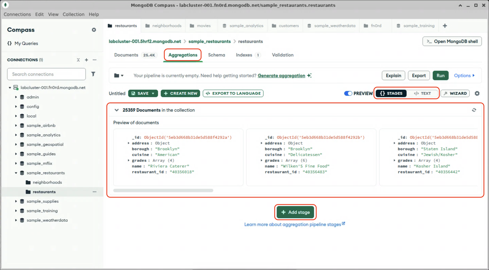
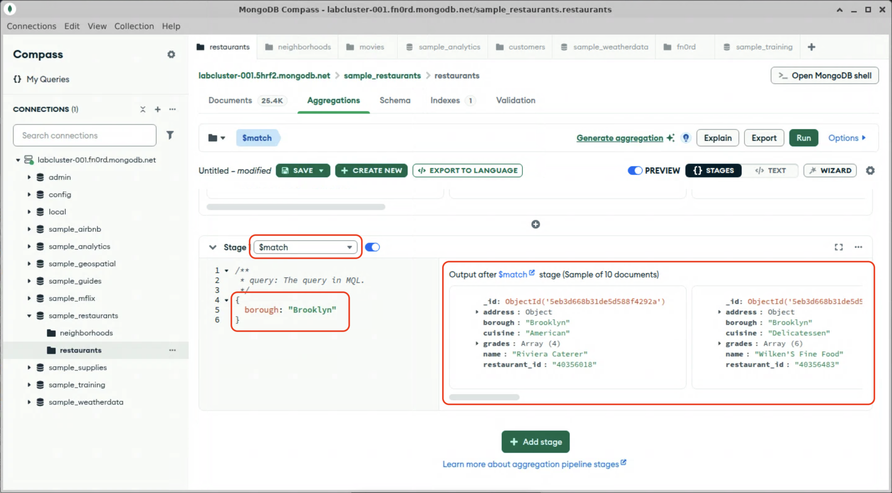

# Matching

Over the next few modules, we're going to build a pipeline to compare average inspection scores across cuisines in Brooklyn. Since aggregations work on each document in sequence, pre-filtering the number of documents to process can improve aggregation performance. The `$match` stage takes a query filter and uses it to select the documents to be passed on the to subsequent stages. 

1. Open Compass and navigate to the `restaurants` collection in the `sample_restaurants` database, if you haven't already done so.

2. Click on "Aggregations", and inspect the aggregation builder interface:
  

  The aggregation builder has two view modes: <kbd>{} STAGES</kbd>, and <kbd>&lt;/&gt; TEXT</kbd>. The "stages" mode shows you the output of each stage as documents pass through the pipeline; the "text" mode shows you the resultant JSON and the final result of the pipeline.

  > [!NOTE]
  > The pipeline is currently empty, so no documents are being filtered. The preview shows 25359 documents in the collection, although only a few are shown in the preview.

3. "Click on "Add Stage".

4. A new blank stage will appear. In the dropdown, select `$match`. The stage will be pre-populated with a placeholder `$match` stage.

5. Edit the `$match` stage to select only restaurants in Brooklyn:
  

  > [!NOTE]
  > You can see that the preview for this stage now only shows documents matching the query filter.

6. Switch to text mode. Observe the JSON that describes the pipeline as it currently stands.
  <details>
  <summary>Expected results</summary>

  ```js
  [
    {
      $match:
        /**
         * query: The query in MQL.
        */
        {
          borough: "Brooklyn"
        }
    }
  ]
  ```

When you are done, switch back to "stages" mode and proceed to the next lab.
