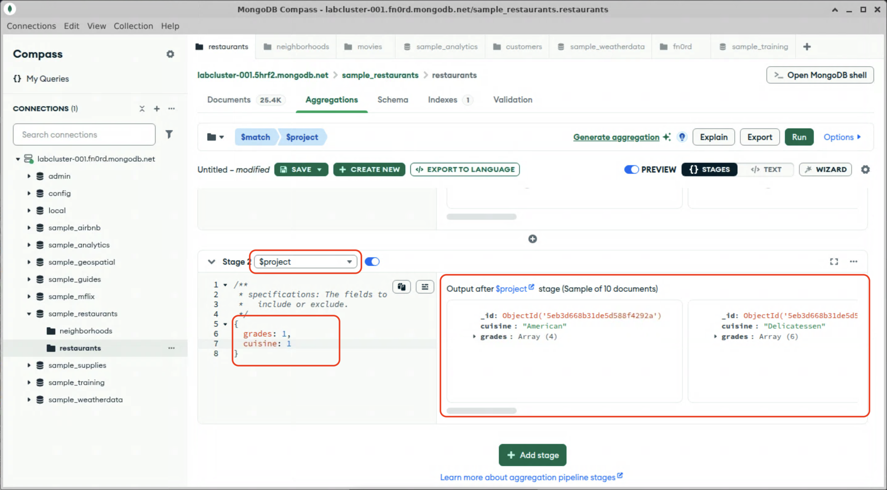

# Projecting

These input documents have data that we won't need in future stages. There are several ways to limit the amount of data processed in the pipeline. We could use the `$unset` stage to remove unnecessary fields; however, since there are only a few fields that we actually need (the cuisine and the grades), we can also use `$project` to output documents with only the fields we are going to use.

1. Click "Add Stage".

2. In the dropdown, select `$project`. The stage will pre-populate with placeholder stage definition.

3. The projection specification in the `$project` stage is the same as we used earlier projecting query results with the `find()` method. Edit the stage definition to project only the `grades` and `cuisine` fields.
  

  Note the output: only the `cuisine` and `grades` fields will be passed on to the next stage.

When you are done, stay on this screen and proceed to the next lab.
