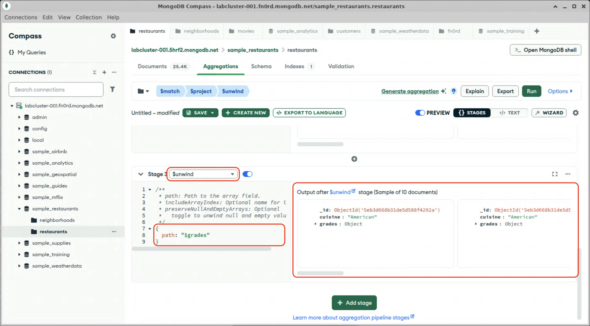

# Unwinding

We currently have all restaurants in Brooklyn in the pipeline. In order to average their inspection scores, we need to unwind the `grades` array into individual documents that can be tallied and averaged. The `$unwind` stage outputs a document for each element in the array that is being unwound.

1. Click "Add Stage"

2. In the dropdown, select `$unwind`. The stage will pre-populate with placeholder stage definition.

3. The `path` parameter defines the the array to be unwound. Edit the stage definition so that the `path` key has the value `"$grades"`.

  > [!TIP]
  > In aggregations, to reference the a field in the document being processed, prefix the path to that field with a "$" character. In this case we are telling the `$unwind` stage to use the `grades` field as the array to unwind.

  

  Note the output: There are now multiple documents for each restaurant: one for each rating.

When you are done, stay on this screen and proceed to the next lab.
