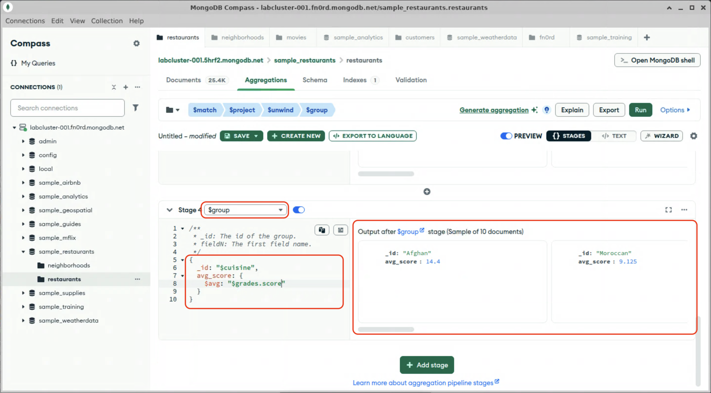

# Grouping and Aggregating

Now we have one input document for each inspection event. To determine the average inspection score by cuising, we will use the `$group` stage to group records based on the `cuisine` field, and keep a running average in a new `avg_score` field. The `$group` stage outputs one document per group, regardless of the number of input documents.

> [!NOTE]
> The aggregation pipeline operates as a stream, wherever possible. This means that, although we increased the number of documents by unwinding the `grades` array, we don't need to hold all of these documents in RAM at the same time. As the documents are passed to the `$group` stage, they are combined into a small number aggregated documents.

1. Click "Add Stage"

2. In the dropdown, select `$group`. The stage will pre-populate with placeholder stage definition.

3. The `_id` value specifies the group key. Documents with the same key will be aggregated into one document. Because we are grouping by cuisine, set the value of `_id` to `$cuisine`.

4. The other fields in the `$group` stage definition are aggregations to be added to each output document. In this case, we want the average of all of the values of `grades.score` for each cuisine type. Set the name of the field to `avg_score`, and the value to the `$avg` operator on the `grades.score` path:
  

  Note the output: There is now one document per cuisine, with the running average of all inspection scores for that cuisine in the `avg_score` field.

When you are done, stay on this screen and proceed to the next lab.
