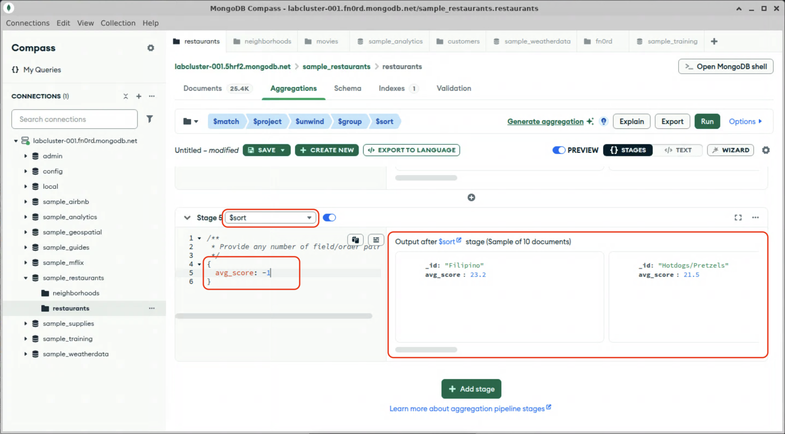

# Sorting

We have our data, now we can sort it by score. We want to see which cuisines have the highest (i.e.: worst) inspection scores, so we will sort by `avg_score` in decending order. The format of the `$sort` stage definition is the same as we used previously sorting queries with the `find()` method.

1. Click "Add Stage"

2. In the dropdown, select `$sort`. The stage will pre-populate with placeholder stage definition.

3. The `$sort` stage takes one or more field/order pairs. Edit the stage definition to sort by `avg_score` in decending order.
  

  Note the output: we have achieved our goal with this pipeline; we have a sorted list of the average inspection scores for different types of restaurants in Brooklyn.

When you are done, proceed to the next lab.
