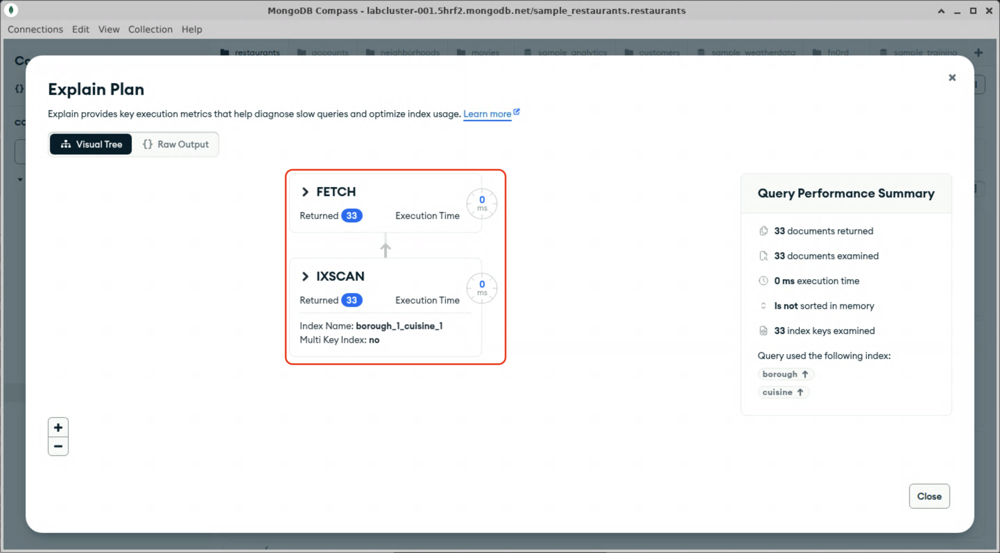
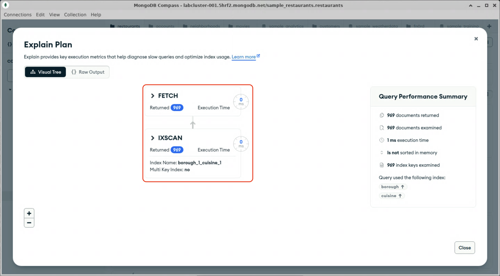

# Compound indexes

So far, we have only been querying based on single fields. What about more complex queries with filters containing multiple fields? For those use cases, MongoDB supports [compound indexes](https://www.mongodb.com/docs/manual/core/indexes/index-types/index-compound/), which index documents on a combination of fields. For this example, we will create an index to efficiently restaurants with a specific cuisine in a specific borough.

## Creating a compound index in mongosh

1. Open mongosh in a terminal window, if you haven't already.

2. Change to the "sample_restaurants" database.
  <details>
  <summary>Hint</summary>

  ```js
  use sample_restaurants;
  ```

  To create an index on multiple fields, simply provide additional field: sort order pairs.

3. Run the following mongosh command to create an index in the `restaurants` collection, containing the `borough` and `cuisine` fields sorted in ascending order:
  ```js
  db.restaurants.createIndex({borough: 1, cuisine: 1});
  ```

  <details>
  <summary>Expected output</summary>

  ```js
  Atlas atlas-fn0rd-shard-0 [primary] sample_restaurants> db.restaurants.createIndex({borough: 1, cuisine: 1});
  borough_1_cuisine_1
  Atlas atlas-fn0rd-shard-0 [primary] sample_restaurants>
  ```
  </details>

  Note that the command returned the name of the created index, `borough_1_cuisine_1`. The name is the fields in the index and their sort orders, concatenated together.

4. In Compass, create a query to find all the Breakfast restaurants on Staten Island and click "Explain".
  <details>
  <summary>Hint</summary>

  ```js
  {borough: "Staten Island", cuisine: "Mexican"}
  ```
  </details>

  <details>
  <summary>Expected result</summary>

  
  </details>

5. Create another query, this time only searching for restaurants on Staten Island, without specifying a cuisine, and click "Explain".
  <details>
  <summary>Hint</summary>

  ```js
  {borough: "Staten Island"}
  ```
  </details>

  <details>
  <summary>Expected result</summary>

  
  </details>

  > [!NOTE]
  > This query used the compound index, because the query field `borough` is a prefix of the compound index.

When you are done, proceed to the next lab.