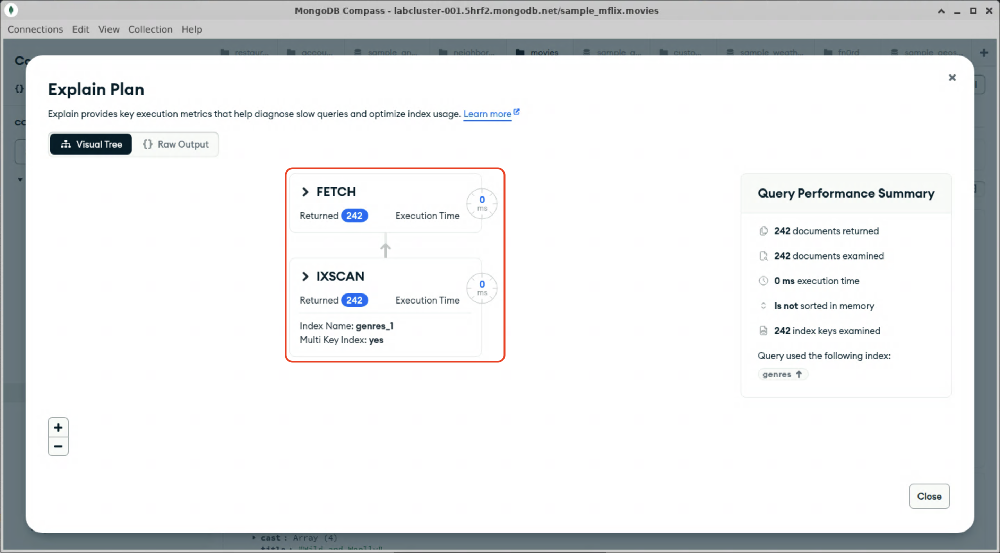

# Multikey Indexes

Multikey indexes support querying values inside embedded arrays. You don't need to explicitly tell MongoDB that you are making multikey index; when you create an index on a field that contains arrays, MongoDB will automatically include all array elements in the index.

## Creating a multi-key index in mongosh

1. Open mongosh in a terminal window, if you haven't already.

2. Change to the "sample_mflix" database.
  <details>
  <summary>Hint</summary>

  ```js
  use sample_mflix;
  ```

  To create a multikey index, simply index a field that contains an array.

3. Run the following mongosh command to create an index in the `movies` collection, on the `genre` field, sorted in ascending order:
  ```js
  db.movies.createIndex({genres: 1});
  ```

  <details>
  <summary>Expected output</summary>

  ```js
  Atlas atlas-fn0rd-shard-0 [primary] sample_mflix> db.movies.createIndex({genres: 1});
  movies_1
  Atlas atlas-fn0rd-shard-0 [primary] sample_mflix>
  ```
  </details>

4. In Compass, browse to the `movies` collection in the `sample_mflix` database, create a query to find all the movies with `Western` in their list of genres, and click "Explain".
  <details>
  <summary>Hint</summary>

  ```js
  {genres: "Western"}
  ```
  </details>

  <details>
  <summary>Expected result</summary>

  
  </details>

When you are done, proceed to the end of this lab.